# atividade mvc
- cliente.json
´´´json
[
    {
        "id":1,
        "cpf":"",
        "nome":""
    },
    {
        "id":2,
        "cpf":"",
        "nome":""
    }
]

´´´

- pedidos.json
´´´json
[
    {
        "id":1,
        "cliente_id":1,
        "produto":"",
        "preco":"",
        "quantidade":""
    }
]

´´´
## Tecnologias
- VsCode
- Node.js
- JavaScript
- JSON

## Passos para executar
- 1 Clone o repositório
- 2 Abra com VsCode e em um teminal CMD ou BASH didige:
```
npm install express cors
npm run dev
```
- 3 Teste as rotas com a extensão **Thunder Client** do *VsCode*

## Rotas_pedido
```
Post time: http://localhost:3000/pedido
Get times: http://localhost:3000/pedido
Put time: http://localhost:3000/pedido/:id
Delete time: http://localhost:3000/pedido/:id
```

## Rotas_cliente
```
Post time: http://localhost:3000/clientes
Get times: http://localhost:3000/clientes
Put time: http://localhost:3000/clientes/:id
Delete time: http://localhost:3000/clientes/:id
```

- Update POST: http://localhost:3000/pedido
```json
{   
    "cliente_id": 5,
    "produto": "0",
    "preco": "",
    "quantidade": ""
  }
```
- Resposta
```json
{
  "id": 2,
  "cliente_id": 5,
  "produto": "0",
  "preco": "",
  "quantidade": ""
}
```

## teste_cliente
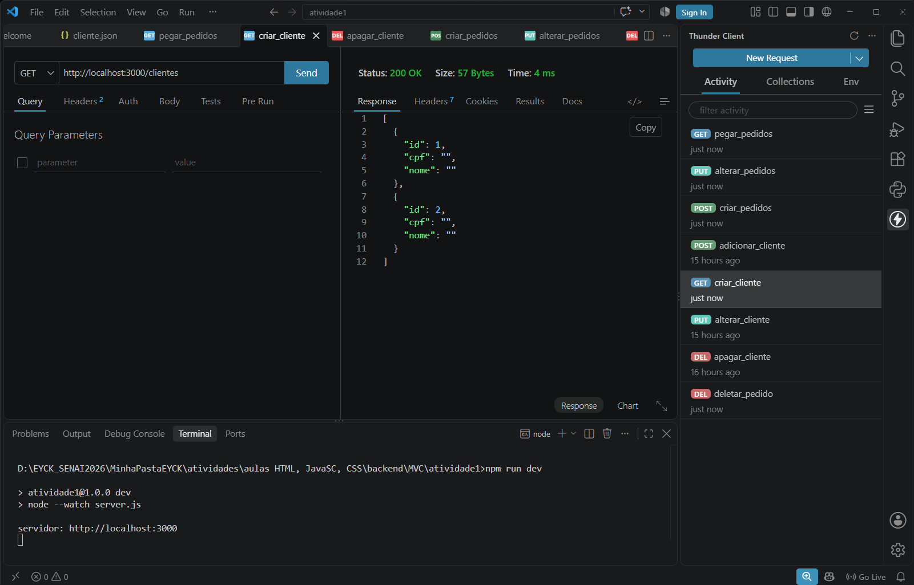
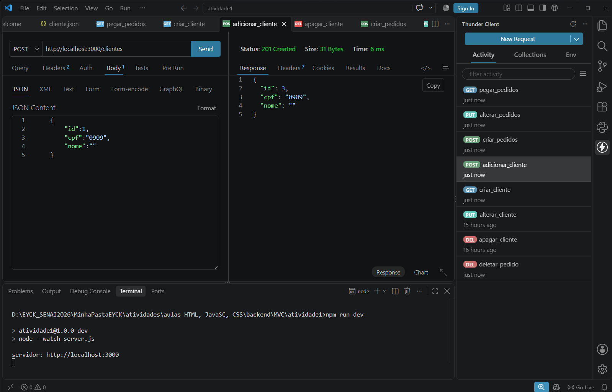
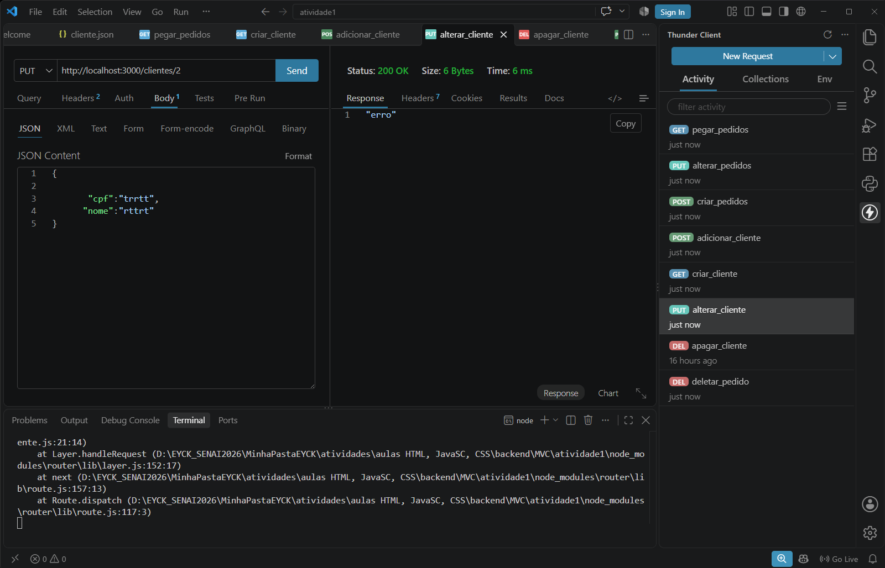
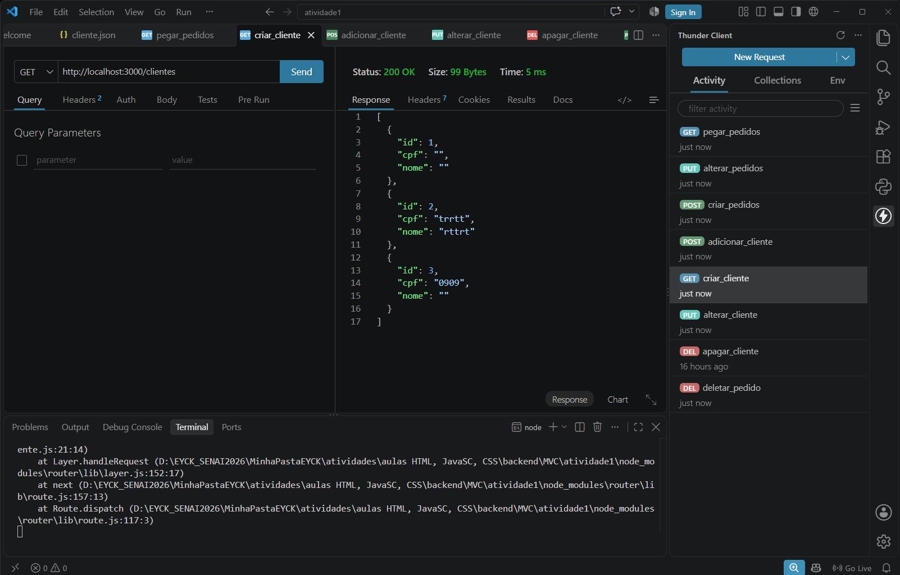
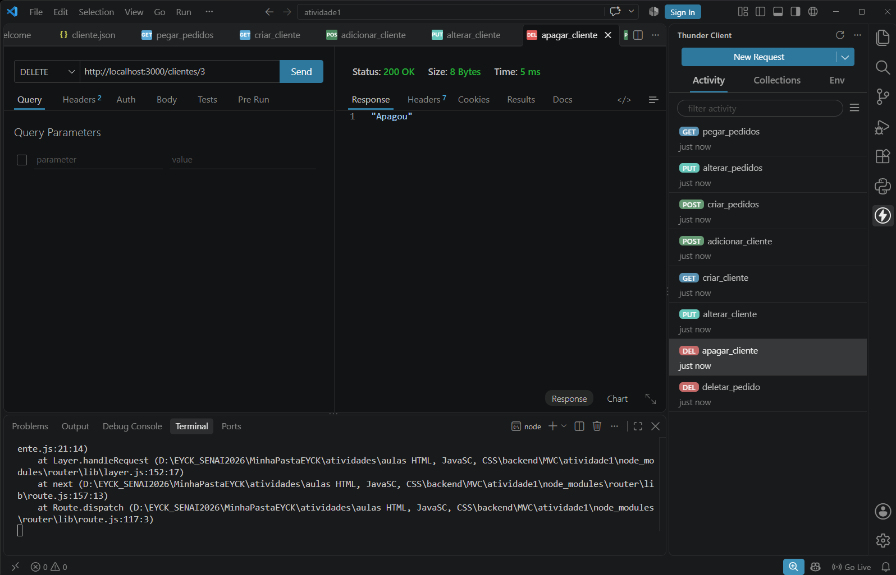
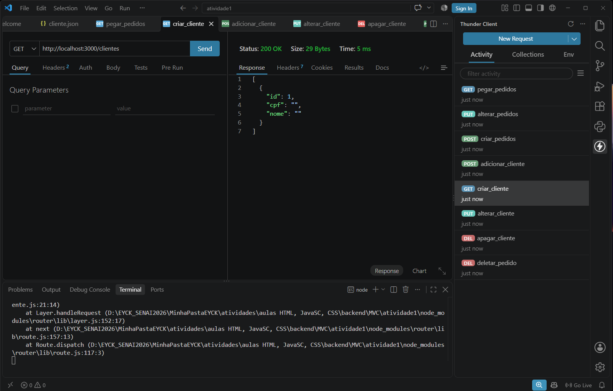
 
## teste_imagens

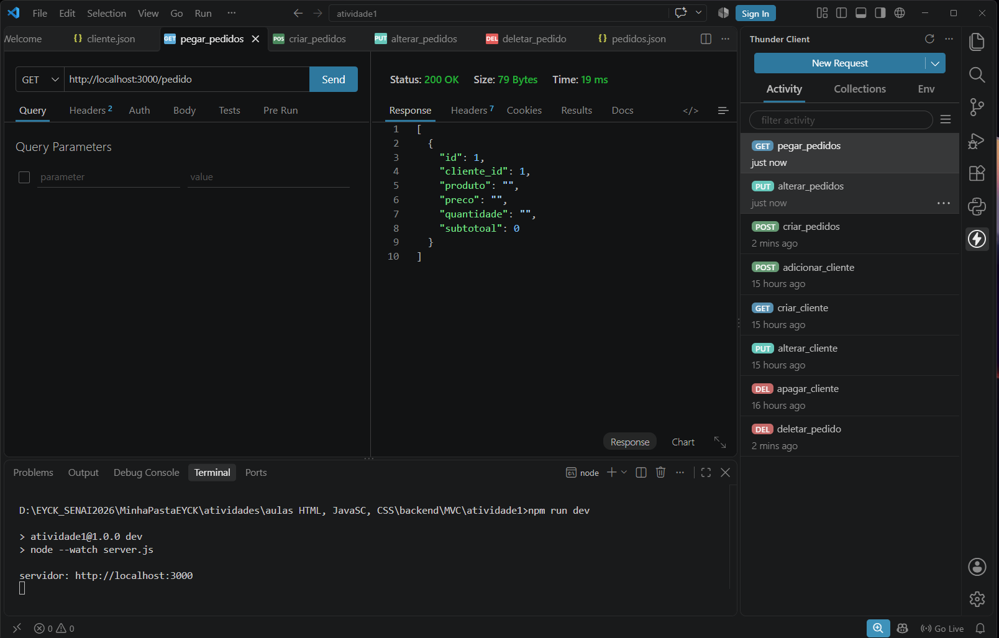
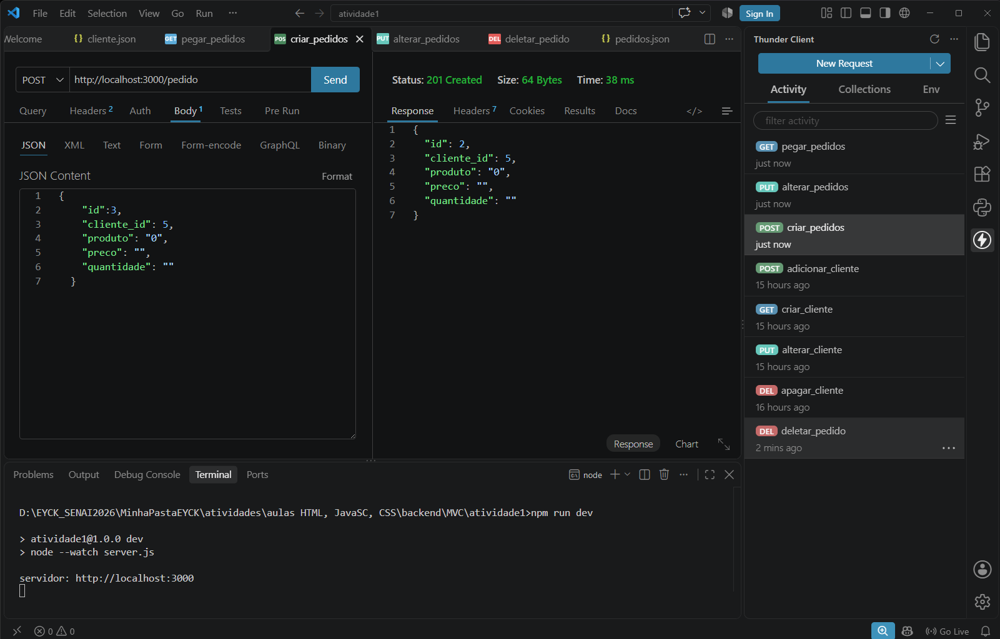
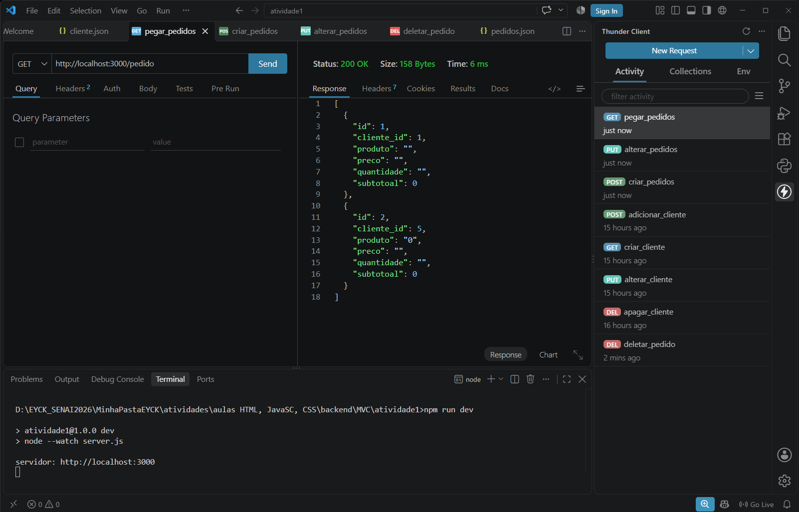
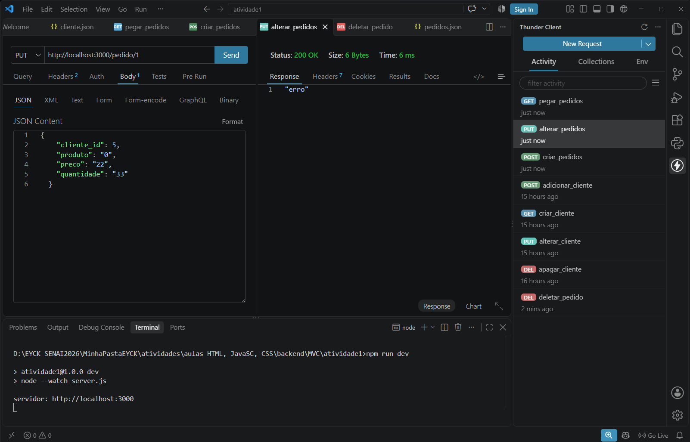
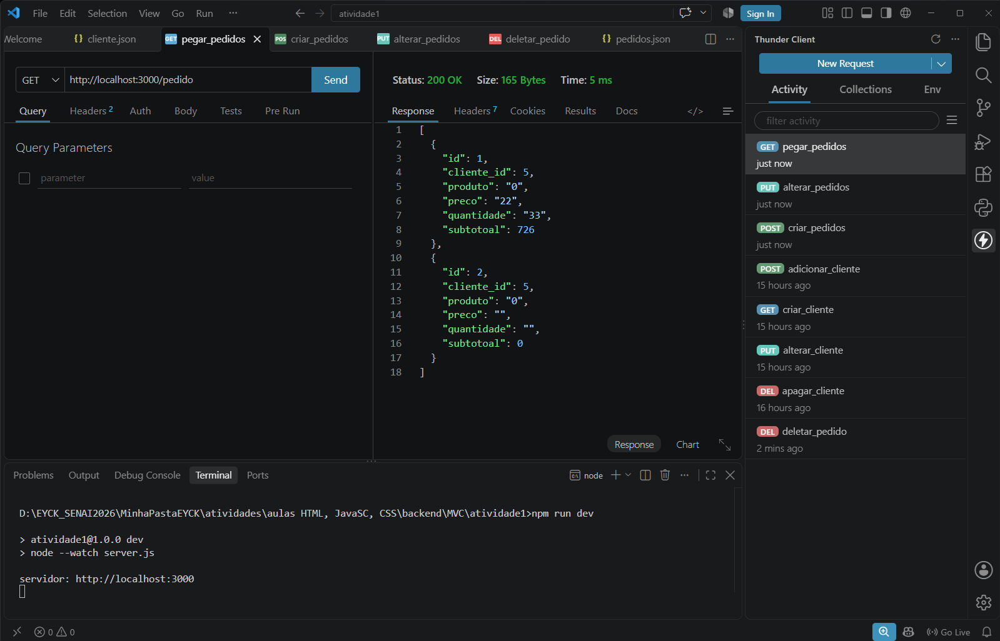
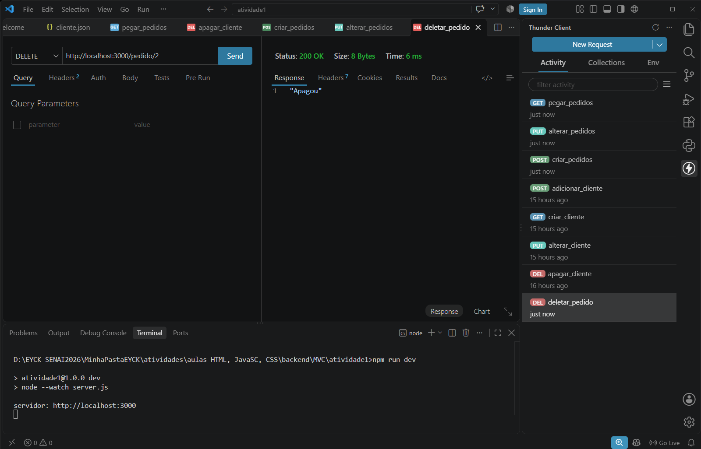
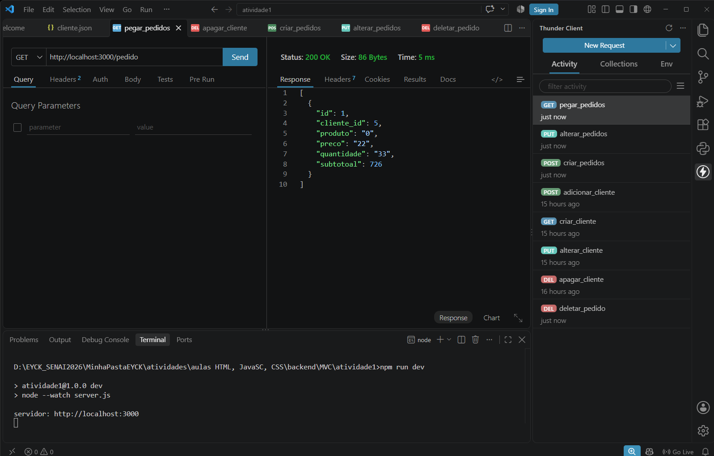